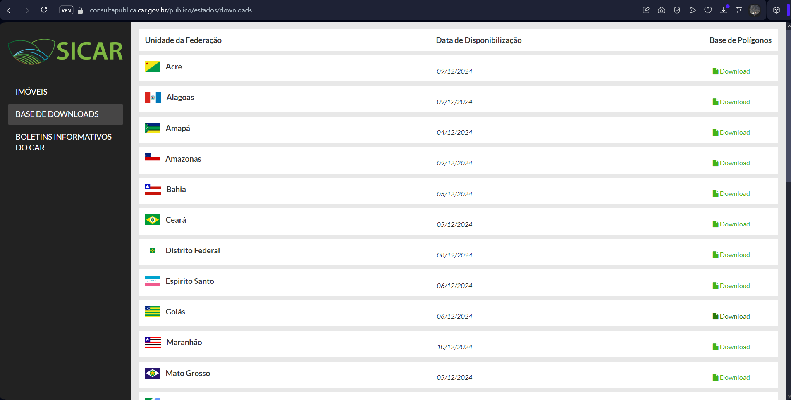
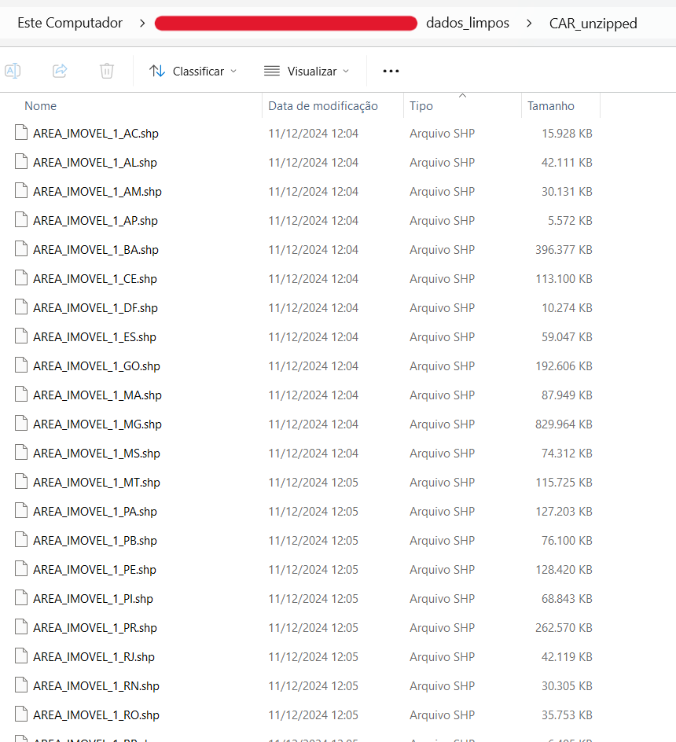

Inteligência Territorial: CAR-BR
================

``` r
# 🌍 ────────────────────────────────────────────────────────────────────────────────────────────────────── 🌍 #
# 🌍                                     THERESA ROCCO PEREIRA BARBOSA                                      🌍 #
# 🌍                               Brazilian | Geologist and Soil Scientist                                 🌍 #
# 🌍                             imakemapas@outlook.com.br | +55 24 998417085                               🌍 #
# 🌍 ────────────────────────────────────────────────────────────────────────────────────────────────────── 🌍 #
```

# Tutorial - etapa 1

## CAR-BR

**1. Acesso ao CAR**

A construção de uma base consolidada do CAR para todo o território
brasileiro começa com o acesso aos dados dos perímetros dos imóveis
rurais cadastrados. Há dois caminhos principais para obter esses dados:
o [serviço geoespacial WFS do
CAR](https://geoserver.car.gov.br/geoserver/wfs) ou o [site oficial do
SICAR](https://consultapublica.car.gov.br/publico/estados/downloads),
onde os arquivos estão organizados por unidade federativa.

Neste tutorial, optaremos pela segunda alternativa, que resulta no
download de 27 pastas compactadas, cada uma contendo os limites do CAR
para uma unidade federativa.

*Acesso: 10 de dezembro, 2024*



**2. Descompactar e Renomear**

Após baixar os arquivos compactados dos 27 Estados, o próximo passo é
descompactá-los e organizá-los com nomes padronizados, preparando-os
para a integração posterior.

Os dados baixados estão armazenados na pasta indicada por `input_dir`,
enquanto os arquivos descompactados e renomeados serão salvos na pasta
especificada por `output_dir`.

``` r
input_dir  <- "../dados_brutos/CAR_zipped"
output_dir <- "../dados_limpos/CAR_unzipped"

# Criar o diretório de saída caso não exista
if (!dir.exists(output_dir)) {
  dir.create(output_dir, recursive = TRUE)
}
```

Por fim, realiza-se uma interação para descompactar e renomear os
arquivos nas pastas listadas:

``` r
# Listar todos os arquivos .zip na pasta input_dir
zip_files <- list.files(input_dir, pattern = "\\.zip$", full.names = TRUE)

# Interação
for (zip_file in zip_files) {
  original_name <- basename(zip_file)
  base_name <- sub("\\.zip$", "", original_name)

  temp_folder <- tempfile(pattern = base_name, tmpdir = output_dir)
  unzip(zip_file, exdir = temp_folder)

  sub_items <- list.files(temp_folder, full.names = TRUE)
  for (item in sub_items) {
    file_ext <- tools::file_ext(item)
    item_base <- tools::file_path_sans_ext(basename(item))
    new_name <- paste0(item_base, "_", base_name, ".", file_ext)
    file.rename(item, file.path(output_dir, new_name))
  }

  unlink(temp_folder, recursive = TRUE)
}
```

Resultando em:



**<mark>Próximas etapas com a base de CAR serão realizadas em Python na
etapa 2 deste tutorial</mark>**

------------------------------------------------------------------------

## LIMITES-IBGE

Para cada imóvel na base CAR-BR, serão atribuídos o bioma
correspondente, a indicação de presença na Amazônia Legal e informações
completas sobre sua localização no território.

**1. Acesso**

Utilizamos os dados dos limites de biomas, Amazônia Legal e municípios,
obtidos conforme descrito a seguir.

- **Biomas**

A obtenção do dado oficial dos limites dos biomas brasileiros pode ser
acessado diretamente no [site oficial do IBGE, seção informações
ambientais](https://www.ibge.gov.br/geociencias/informacoes-ambientais/vegetacao/15842-biomas.html?=&t=downloads).
Ao acessar o site, certifique-se de baixar o dado mais recente,
referente ao ano de **2019**, com escala de **1:250 mil**, para garantir
a precisão dos dados na análise.

- **Amazônia Legal**

A obtenção do dado oficial do limite da Amazônia Legal pode ser acessado
diretamente no [site oficial do IBGE, seção mapas
regionais](https://www.ibge.gov.br/geociencias/cartas-e-mapas/mapas-regionais/15819-amazonia-legal.html?=&t=o-que-e).

A Amazônia Legal corresponde à área de atuação da Superintendência de
Desenvolvimento da Amazônia – SUDAM delimitada em consonância ao Art. 2o
da Lei Complementar n. 124, de 03.01.2007.

- **Municípios**

A obtenção do dado oficial dos limites dos municípios brasileiros pode
ser acessado diretamente no [site oficial do IBGE, seção organização do
território](https://www.ibge.gov.br/geociencias/organizacao-do-territorio/malhas-territoriais/15774-malhas.html?=&t=downloads).

**2. Descompactar e Reprojetar**

Após o download, esses dados serão descompactados e reprojetados para a
projeção Cônica Equivalente de Albers com o datum horizontal SIRGAS2000,
recomendada pelo Instituto Brasileiro de Geografia e Estatística (IBGE)
para preservação e cálculo de áreas no território nacional.

Referência: [Informações técnicas e legais para a utilização dos dados
publicados (IBGE,
2023).](https://biblioteca.ibge.gov.br/index.php/biblioteca-catalogo?view=detalhes&id=2101998).
Acesso em novembro de 2024.

**Definir os diretórios de entrada e saída**

Os dados baixados estão armazenados na pasta indicada por `input_dir`,
enquanto os arquivos descompactados e renomeados serão salvos na pasta
especificada por `output_dir`.

``` r
input_dir  <- "../dados_brutos"
output_dir <- "../dados_limpos"
```

**Projeção recomendada pelo IBGE**

``` r
final_crs <- 'PROJCS["Conica_Equivalente_de_Albers_Brasil",
    GEOGCS["GCS_SIRGAS2000",
    DATUM["D_SIRGAS2000",
    SPHEROID["Geodetic_Reference_System_of_1980",6378137,298.2572221009113]],
    PRIMEM["Greenwich",0],
    UNIT["Degree",0.017453292519943295]],
    PROJECTION["Albers"],
    PARAMETER["standard_parallel_1",-2],
    PARAMETER["standard_parallel_2",-22],
    PARAMETER["latitude_of_origin",-12],
    PARAMETER["central_meridian",-54],
    PARAMETER["false_easting",5000000],
    PARAMETER["false_northing",10000000],
    UNIT["Meter",1]]'
```

**Função para descompactar e reprojetar dados**

``` r
processar_dados  <- function(zip_name, 
                            output_dir_folder, 
                            original_shp_name, 
                            projected_shp_name
                            ) {
  
  # Criar o diretório de saída caso não exista
  output_dir     <- file.path(output_dir, 
                             output_dir_folder)
  if (!dir.exists(output_dir)) {
    dir.create(output_dir, recursive = TRUE)
  }

  # Descompactar ZIP
  zip_file       <- file.path(input_dir, 
                             zip_name)
  unzip(zip_file, exdir = output_dir)

  # Carregar e reprojetar o arquivo vetorial
  shp_path       <- file.path(output_dir, 
                             original_shp_name)
  vetor          <- terra::vect(shp_path)
  vetor_prj      <- terra::project(vetor, 
                                  final_crs)

  saida_prj_path <- file.path(output_dir, 
                              projected_shp_name)
  terra::writeVector(vetor_prj, 
                     saida_prj_path, 
                     overwrite = TRUE)
}
```

**Processar os diferentes conjuntos de dados**

``` r
processar_dados(
  zip_name           = "Biomas_250mil.zip",
  output_dir_folder  = "biomas_unzipped",
  original_shp_name  = "lm_bioma_250.shp",
  projected_shp_name = "bioma_prj.shp"
)

processar_dados(
  zip_name           = "Limites_Amazonia_Legal_2022_shp.zip",
  output_dir_folder  = "amazonia_legal_unzipped",
  original_shp_name  = "Limites_Amazonia_Legal_2022.shp",
  projected_shp_name = "amazonia_legal_prj.shp"
)

processar_dados(
  zip_name           = "BR_Municipios_2022.zip",
  output_dir_folder  = "municipios_unzipped",
  original_shp_name  = "BR_Municipios_2022.shp",
  projected_shp_name = "municipios_prj.shp"
)
```

## FITOFISIONOMIAS, AMAZÔNIA LEGAL E ART.12 CODIGO FLORESTAL (LEI )

Os percentuais de Reserva Legal (RL) na Amazônia Legal não dependem dos
limites do bioma Amazônia ou do bioma Cerrado, mas sim das
fitofisionomias presentes no imóvel. O Código Florestal (Art. 12)
determina que os percentuais mínimos de RL são:

- 80% para áreas de florestas.
- 35% para áreas de cerrado.
- 20% para áreas de campos gerais.

Para imóveis com mais de uma fitofisionomia, os percentuais devem ser
aplicados *separadamente* para cada formação.

**Acesso**

Utilizamos os dados dos limites de biomas, Amazônia Legal e municípios,
obtidos conforme descrito a seguir.

- **Mapa Vegetação**

A obtenção do dado oficial das cartas sobre a vegetação brasileira pode
ser acessado diretamente no [site oficial do IBGE, seção informações
ambientais](https://geoftp.ibge.gov.br/informacoes_ambientais/vegetacao/vetores/escala_250_mil/).
Ao acessar o site, certifique-se de baixar o dado mais recente,
referente ao ano de **2023**, com escala de **1:250 mil**, para garantir
a precisão dos dados na análise.

**Processar os dados de vegetacao utilizando a função para descompactar
e reprojetar anterior**

``` r
processar_dados(
  zip_name           = "vege_area.zip",
  output_dir_folder  = "fitofisionomia_unzipped",
  original_shp_name  = "vege_area.shp",
  projected_shp_name = "fitofisionomia_prj.shp"
)
```

**Simplificar Mapa Vegetação - Fitofisionomias (legenda_1)**

- **Leitura**

``` r
mapa_veg  <- terra::vect("../dados_limpos/fitofisionomia_unzipped/fitofisionomia_prj.shp")
```

- **Verificar as colunas**

``` r
print(names(mapa_veg))
```

    ##  [1] "id1"        "cd_fcim"    "leg_carga"  "cd_fito"    "cd_leg_2"   "clas_domi"  "leg_uveg"   "nm_uveg"    "leg_uantr"  "nm_uantr"   "leg_contat" "nm_contat" 
    ## [13] "veg_pretet" "nm_pretet"  "leg_sec1"   "nm_sec1"    "leg_sec2"   "nm_sec2"    "leg_sup"    "legenda_1"  "legenda_2"  "legenda"    "ar_poli_km" "leg1_id"   
    ## [25] "leg2_id"

- **Calcular a frequência da coluna “legenda_1”**

``` r
frequencia <- table(mapa_veg$legenda_1)
print(frequencia)
```

    ## 
    ##                      Campinarana      Contato (Ecótono e Encrave)         Corpo d'água continental                           Estepe 
    ##                             2498                            18822                            44449                              737 
    ##     Floresta Estacional Decidual Floresta Estacional Semidecidual Floresta Estacional Sempre-Verde        Floresta Ombrófila Aberta 
    ##                             2577                             8115                             2610                             8756 
    ##         Floresta Ombrófila Densa         Floresta Ombrófila Mista                Formação Pioneira                           Savana 
    ##                            21802                             2426                             5880                            20417 
    ##                  Savana-Estépica 
    ##                             6369

- **Simplificação**

``` r
mapa_veg$legenda_1 <- ifelse(grepl("Floresta",
                                        mapa_veg$legenda_1, 
                                        ignore.case = TRUE), "floresta",
                                  
                                  ifelse(grepl("água",
                                               mapa_veg$legenda_1,
                                               ignore.case = TRUE), "agua_cont",
                                        
                                        ifelse(grepl("Savana",
                                                     mapa_veg$legenda_1,
                                                     ignore.case = TRUE), "savana",
                                               
                                               ifelse(grepl("Contato",
                                                            mapa_veg$legenda_1,
                                                            ignore.case = TRUE), "ecotono",
                                                      
                                                      ifelse(grepl("Pioneira",
                                                                   mapa_veg$legenda_1,
                                                                   ignore.case = TRUE), "pioneira",
                                                             
                                                             mapa_veg$legenda_1)))))
```

``` r
frequencia <- table(mapa_veg$legenda_1)
print(frequencia)
```

    ## 
    ##   agua_cont Campinarana     ecotono      Estepe    floresta    pioneira      savana 
    ##       44449        2498       18822         737       46286        5880       26786

- **Dissolver**

Dissolver (aggregate) combina todas as geometrias que têm o mesmo valor
para a(s) variável(eis) especificada(s) com o argumento `by`

Geometrias inválidas ou problemas com valores nulos em colunas do
SpatVector podem gerar problemas

*Verificar e corrigir polígonos*

``` r
any(is.na(mapa_veg$legenda_1))
```

    ## [1] FALSE

``` r
validity <- terra::is.valid(mapa_veg)
table(validity)
```

    ## validity
    ##  FALSE   TRUE 
    ##     32 145426

``` r
mapa_veg <- terra::makeValid(mapa_veg)
```

``` r
any(is.na(mapa_veg$legenda_1))
```

    ## [1] FALSE

``` r
validity <- terra::is.valid(mapa_veg)
table(validity)
```

    ## validity
    ##   TRUE 
    ## 145458

*Mapa Vegetação - Fitofisionomias final*

``` r
mapa_veg <- terra::aggregate(mapa_veg, 
                             by = "legenda_1", 
                             dissolve = TRUE)
```

- **Exportar**

``` r
terra::writeVector(mapa_veg,
                   ("../dados_limpos/fitofisionomia_unzipped/fitofisionomia_prj_final.shp"),
                   overwrite = TRUE)
```

``` r
# rmarkdown::render("1_acessar_preparar_dados.Rmd", 
#                   output_format = "github_document")
```
